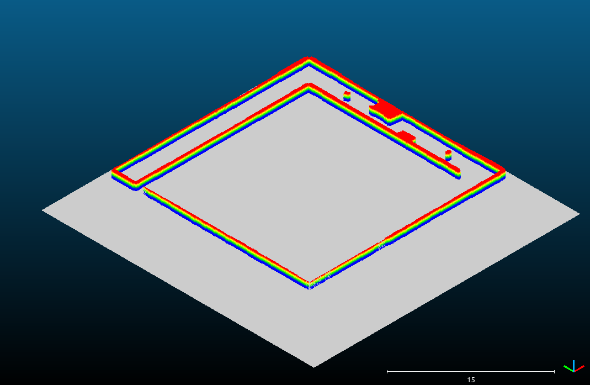

# ME5413_Final_Project

## 1 Project Overview

This project is part of the ME5413 Autonomous Mobile Robotics course at NUS. It involves simulating a mobile robot in a Gazebo environment using ROS Noetic. The main tasks include mapping the environment using SLAM, navigating using a saved map, and interacting with randon generated elements like bridges and boxes with figures.

In this project, users can launch the simulated Jackal robot to autonomously explore the environment, identify and count four types of destination boxes (with randomly generated numbers), determine which box type appears the least, and navigate toward a matching destination. Along the way, the robot must locate a randomly placed bridge, unlock its blockade, cross it, and dock at the correct box.

## 2 Installation

### Dependencies

 - System Requirements:
   - Ubuntu 20.04 (18.04 not yet tested)
   - ROS Noetic (Melodic not yet tested)
   - C++11 and above
   - CMake: 3.0.2 and above

### How to use

1. Clone this repository by ssh

    ```shell
    git clone --recure-submodules git@github.com:AAAAAAABYSSS/ME5413-Final-Project-Group6.git
    ```

2. Compile and run:

    ```shell
    cd ME5413-Final-Project-Group6
    bash scripts/start.sh
    ```

3. Go back to the original terminal and enter the above command, choose the mode you want:

    ```shell
    0: Launch world
    1: Mapping Mode
    2: Navigation Mode
    3: Perception Mode
    ```

## 3 Feature

- Mapping 
    - [x] Cartographer
    - [x] Fast-Livo2
    - [x] Explore_lite
- Localisation
    - [x] AMCL
    - [x] NDT
- Global planner switch
    - [x] dijkstra
    - [x] dstar
    - [x] voronoi
    - [x] theta_star
    - [x] astar  
- Local planner switch
    - [x] TEB
    - [x] PID

Note: easily change arg `local_planner` in `src/me5413_navigation/launch/navigation_new.launch`.

## 4 Project Structure

```shell
.
├── scripts
|   └── start.sh             # One-click start
└── src
    ├── interactive_tools    # Interactive tools for rviz
    ├── jackal_description   # Modified Jackal model package
    ├── me5413_control       # Modified Jackal control package
    ├── me5413_evaluation    # SLAM evo evaluation and box identification evaluation
    ├── me5413_mapping       # Mapping package
    ├── me5413_navigation    # Navigation package
    ├── me5413_perception    # Perception package
    ├── me5413_thirdparty    # Third-party packages
    └── me5413_world         # Gazebo simulation package
```

## 5 Configuration

### 5.1 Mapping and SLAM

1. 3D Cartographer + Manual

    After compiling, launch the gazebo world and manual control by:
    ```shell
    roslaunch me5413_world world.launch
    roslaunch me5413_world manual.launch
    ```
    Then use Cartographer to build the map manually. 

    An example of mapping by 3D Cartographer is shown as follows:
    <p align="center">
      
    </p>

2. 2D Cartographer + Explore Lite

    Recompile the workspace:
    ```shell
    bash scripts/ws_setup.bash
    ```
    Start the mapping mode by bash:
    ```shell
    bash scripts/mapping.bash
    ```

    Then in the original terminal, choose __`0`__ for mapping mode, then thoose __`1`__ for Explore Lite Control. Subsequently, the Jackal will autonomously explore the whole environment during 250 seconds, and then save the map under `src/me5413_world/maps/`.

    An example of mapping by 2D Cartographer with Explore Lite is shown as follows:
    <p align="center">
      
    </p>

3. Fast-Livo2 **************************
    
    Start the mapping mode by bash:
    ```shell
    bash scripts/mapping.bash
    ```

    An example of mapping by Fast-Livo2 is shown as follows:
    <p align="center">
      
      
      
      
    </p>


### 5.2 Planning and Control

1. To switch global planner, please switch arg `global_planner` in `src/me5413_navigation/launch/launch_new.launch`

2. To switch local planner, please switch arg `local_planner` in `src/me5413_navigation/launch/launch_new.launch`

```
  <include file="$(find me5413_evaluation)/launch/evo_evaluation.launch" />
    <arg name="global_planner" default="dstar" />
    <!-- local planner name -->
    <arg name="local_planner" default="teb" />
  </include>
```

## 6 Acknowledgement

We would like to thank the following open-source projects:

- [ME5413_Final_Project](https://github.com/NUS-Advanced-Robotics-Centre/ME5413_Final_Project)
- [Fast-Livo2](https://github.com/hku-mars/FAST-LIVO2)
- [ros_motion_planning](https://github.com/ai-winter/ros_motion_planning)
- [Autonomous Robot Navigation](https://github.com/brian00715/Autonomous-Robot-Navigation)
- [explore_lite](https://github.com/hrnr/m-explore.git)
- [ira_laser_tools](https://github.com/iralabdisco/ira_laser_tools.git)
- [cartographer](https://github.com/cartographer-project/cartographer.git)
- [cartographer_ros](https://github.com/cartographer-project/cartographer_ros.git)

## 7 Compiler Errors

### C++14 Compiler Requirement
If you encounter build errors related to `std::optional` or `std::any` when compiling `me5413_world`, it is likely due to the C++ standard version being set too low.

Replace the following lines in `src/me5413_world/CMakeLists.txt`:
```
## Compile as C++11, supported in ROS Kinetic and newer
# add_compile_options(-std=c++11)
```
with
```
set(CMAKE_CXX_STANDARD 14)
set(CMAKE_CXX_STANDARD_REQUIRED ON)
```

This explicitly sets the C++ standard to C++14, which is required by some dependencies such as sdformat and ignition-transport.

### Sphinx Build Error Due to Jinja2 Version

When building Cartographer ([`ws_setup.bash` line 16](./scripts/ws_setup.bash)), the following error may occur during the documentation build step:
```shell
Extension error:
Could not import extension sphinx.builders.latex (exception: cannot import name 'contextfunction' from 'jinja2')
```
This is caused by an incompatible version of `jinja2` (v3.1 or above). To resolve this issue, downgrade `jinja2` to a compatible version:
```shell
pip install jinja2==3.0.3
```
After downgrading, rerun the build with:
```shell
cd src/me5413_thirdparty/cartographer
rm -rf build
mkdir build
cd build
cmake .. -DCMAKE_INSTALL_PREFIX=/usr/local
make -j4
sudo make install
touch ../CATKIN_IGNORE
```
Then retry setup:
```shell
cd ~/ME5413_Final_Project_yuku/
bash scripts/ws_setup.bash
```

<!-- ## 4 One more thing

If you have any question, please contact Yvelle@Github. -->